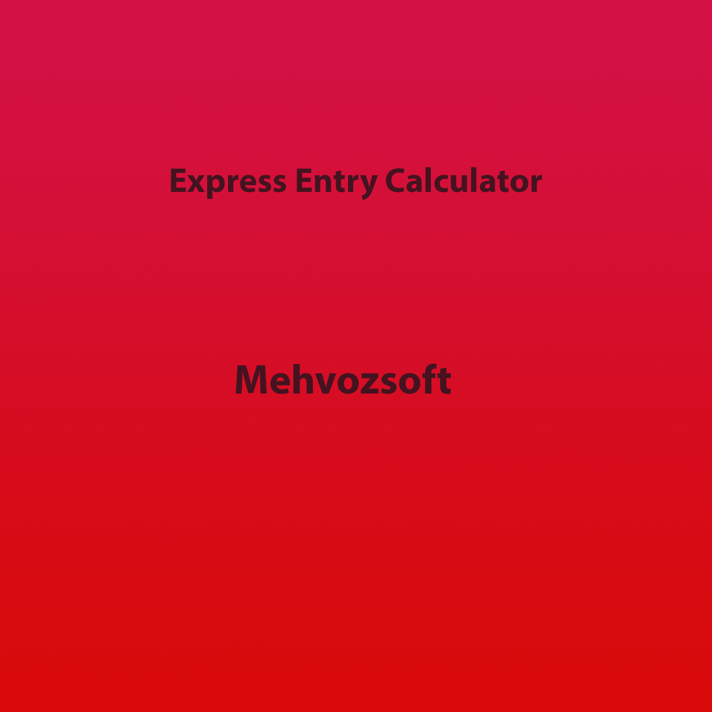
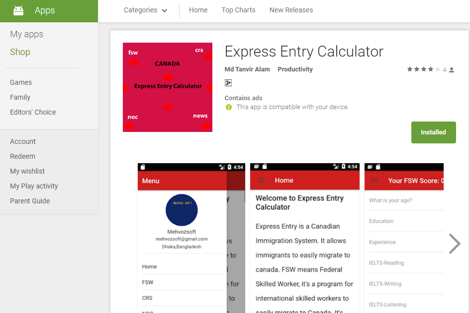
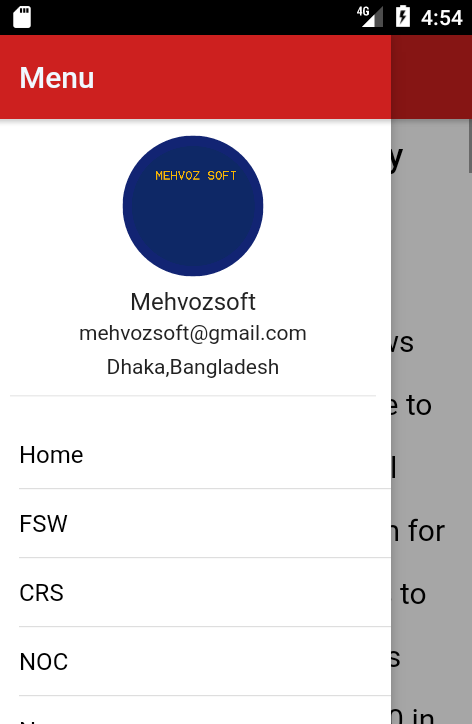
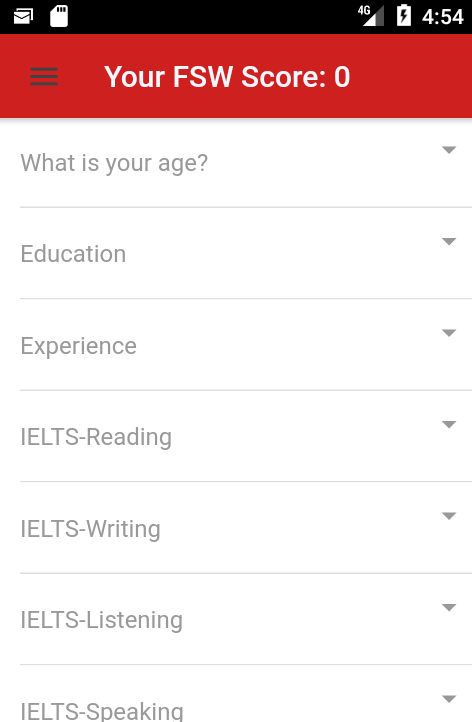
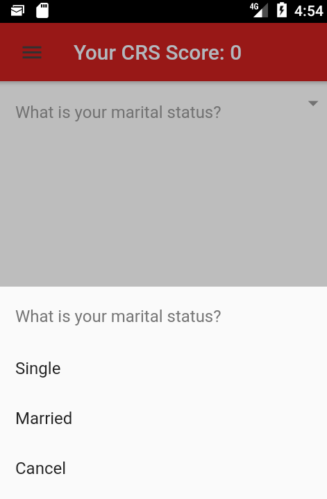
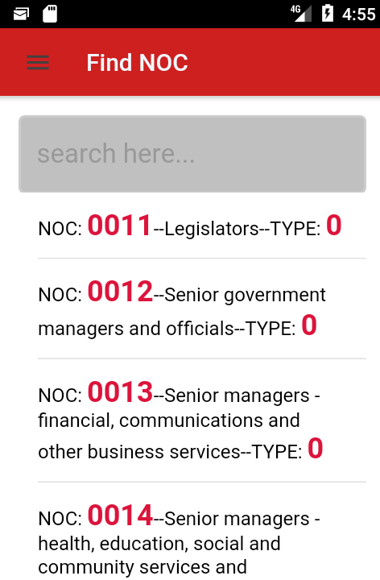
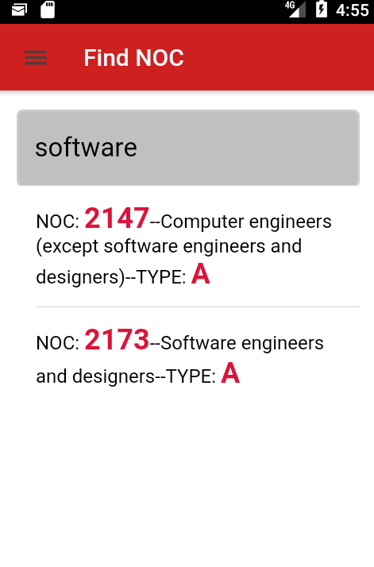

# Express Entry Calculator

### This is my production app built with Angular and Ionic
### It is completely free and will remain free forever worldwide
### You can donate to support the project.
 

#### I can't upload full source code of this project due to privacy

## Some screenshot and Google Play Store link is given below:

# Features 
### 1. Ionic Side Menu for 6 pages
### 2. Ionic admobfree integration for both banner and interstitial ads
### 3. In NOC pages real time search integration using angular custom pipe
### 4. Implementing ionic cordova composemail for sending mail directly from the app contact page

[Express Entry Calculator](https://play.google.com/store/apps/details?id=com.ionicframework.expressentrycalculator)

# Thanks for visiting